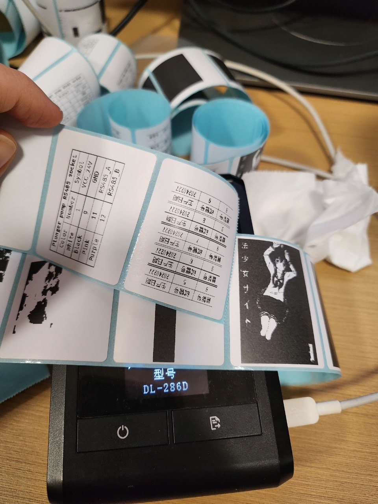

# Deli DL-286D CUPS Driver



[中文说明 / Chinese README](README.zh.md)

## Overview
This repository hosts a GPLv3 CUPS raster filter (`dl286d-raster`) and a minimal ppdc source (`dl286d.drv`) that were reverse-engineered from USB traces of the Deli DL-286D label printer. The filter ingests `application/vnd.cups-raster` data, applies scaling plus ordered dithering, and emits the ESC/POS sequence expected by the printer.

> **Limitations**: Only the wired USB transport is supported today—Bluetooth mode is not implemented. Media handling is tuned for the stock 40 mm × 50 mm labels; other sizes may render incorrectly.

## Build & Install
1. Build the raster filter and install it for cupsd:
   ```bash
   gcc -O2 -std=c11 -Wall -Wextra \
     $(cups-config --cflags) $(cups-config --ldflags) \
     dl286d-raster.c -o dl286d-raster $(cups-config --image --libs)
   sudo install -m 755 dl286d-raster /usr/lib/cups/filter/
   ```
2. Compile the PPD and install it:
   ```bash
   mkdir -p ppd
   ppdc -d ppd dl286d.drv
   sudo install -m 644 ppd/dl286d.ppd /usr/share/cups/model/
   ```

## Testing
Follow the pipeline embedded in `dl286d-raster.c`:
```bash
cupsfilter -p /path/to/dl286d.ppd -m application/vnd.cups-raster input.png \
  | ./dl286d-raster \
  | lp -d dl286d-raw
```
Use fixtures that exercise both the 1 bpp and 24/32 bpp paths to confirm dithering and threshold logic before printing real labels.

## Packaging
Three reference packages live in this repo:
- **Arch Linux**: edit `pkgname`/`source` in `PKGBUILD`, then run `makepkg -si`.
- **Debian/Ubuntu**: bump `Version` in `debian/changelog`, then run `dpkg-buildpackage -us -uc`.
- **Nix/NixOS**: run `nix-build` using `default.nix`; override `src`/`rev` with your published tag.
Prebuilt artifacts generated from this commit are placed under the `release/` directory for convenience when drafting a GitHub release.

## License & Contributions
Licensed under GPL-3.0-or-later as noted in the source banner. Bug reports and pull requests that include reproduction steps or USB traces are welcome; please call out any deviations from real hardware since this code is based on best-effort reverse engineering.

**Legal notice**: This project was developed by observing USB communication of the device. No source code, binaries, or copyrighted material from the manufacturer were used. The driver is an independent clean-room implementation.
